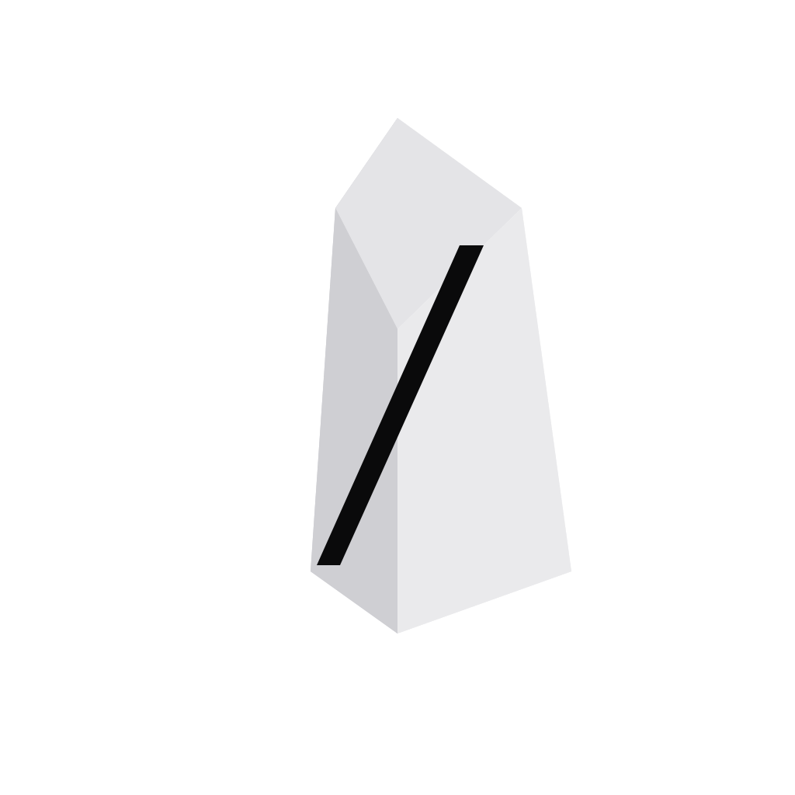

<p align="center">
  
</p>

# ObsidianOS

Desktop study workspace for an Obsidian vault. The app scans course folders, indexes markdown notes into a local graph, surfaces weakly linked notes, generates flashcards, and writes a daily revision note back into the vault.

## Landing page

The browser build is a standalone product page emitted into the root `landing/` folder for branch-based GitHub Pages publishing from this repository:

```text
https://elsyvien.github.io/ObsidianOS/
```

Run the landing page locally:

```powershell
npm install
npm run dev
```

Build the GitHub Pages bundle:

```powershell
npm run build
```

The generated static files will be written to:

```text
landing\
```

For GitHub Pages, use:

```text
Branch: master (or main)
Folder: /landing
```

## Desktop app

Run the desktop app in development:

```powershell
npm install
npm run desktop:dev
```

Build the packaged desktop app:

```powershell
npm install
npm run desktop:build
```

The Tauri frontend uses a separate desktop-safe Vite mode with relative asset paths so the packaged app stays unchanged.

Tauri bundle output is written under:

```text
src-tauri\target\release\bundle\
```

On Windows, the installer or executable will appear in the `msi` and/or `nsis` subfolders if the bundle step succeeds.

## Required toolchain

- Node.js 20+
- Rust stable
- Microsoft Visual Studio C++ Build Tools on Windows
- WebView2 runtime on Windows

## First run

1. Start the desktop app with `npm run desktop:dev`.
2. Open `Setup`.
3. Connect your vault path, for example:

```text
C:\Users\maxwi\source\repos\ObsidianVault\MaxVault\Uni
```

4. Run a scan.
5. Open `Courses` or `Notes` to review the imported material.

## Current product scope

- One Obsidian vault connected at a time
- Top-level vault folders imported as course spaces
- Markdown-only indexing for `.md` notes
- Local deterministic extraction with optional OpenRouter / OpenAI-compatible refinement
- Markdown flashcard output plus Anki CSV export
- Daily revision note generation into the vault
- The website is a marketing/showcase page, not the running app itself
